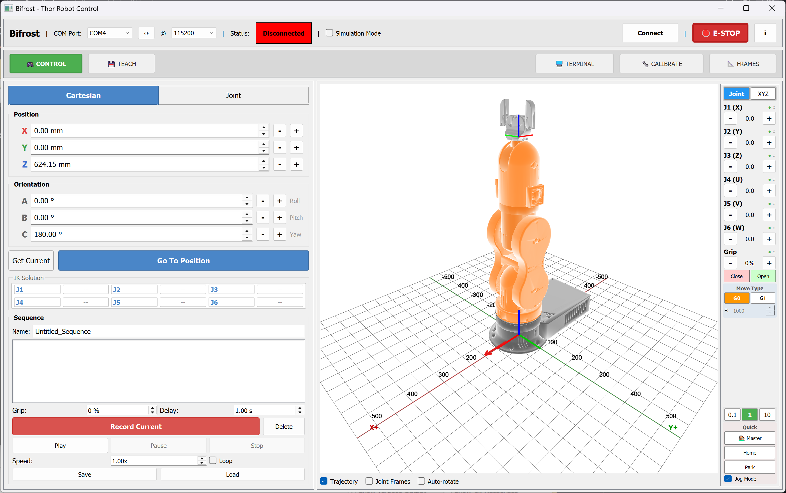

# Bifrost

Bifrost is a control GUI for the [Thor](https://github.com/AngelLM/Thor) open-source 6-axis robot arm, built with [PyQt5](https://riverbankcomputing.com/software/pyqt/download5).

Originally forked from [Asgard](https://github.com/AngelLM/Asgard), Bifrost has been extensively rewritten to target [RepRapFirmware](https://github.com/Duet3D/RepRapFirmware) on the BTT Octopus Pro v1.0 controller board, connected via USB serial.



## Features

- **Forward Kinematics** with configurable DH parameters
- **Inverse Kinematics** with real-time Cartesian jogging
- **3D Visualisation** of the robot arm using STL meshes (PyQtGraph + OpenGL)
- **Sequence Recorder** for recording, saving, loading, and playing back movement sequences
- **Gripper Control** with calibratable PWM servo
- **Coordinate Frames** with base frame and tool offset support
- **Differential Wrist Kinematics** handling the coupled J5/J6 bevel gear mechanism
- **Simulation Mode** for testing without hardware connected
- **Motor Calibration Panel** for DH parameters, motor direction, and gripper PWM tuning

## Quick Start (Standalone)

Download `bifrost.exe` from the releases page and run it. On first launch a `Bifrost_Data/` folder is created next to the exe containing default configuration files. Your calibration and settings are saved there and persist between sessions.

## Running from Source

Requires **Python 3.10+**.

```bash
pip install -r requirements.txt
python bifrost.py
```

### Dependencies

- PyQt5
- numpy
- scipy
- pyqtgraph
- PyOpenGL
- numpy-stl
- pyserial
- matplotlib

## Building the Exe

```bash
pip install pyinstaller
pyinstaller bifrost.spec --noconfirm
```

Output: `dist/bifrost.exe` (~90 MB standalone executable).

## Hardware

- **Controller:** BTT Octopus Pro v1.0 (STM32F446)
- **Firmware:** RepRapFirmware 3.6.1
- **Connection:** USB serial (115200 baud)
- **Drivers:** A4988 stepper drivers, 16x microstepping

## Acknowledgements

- **[AngelLM](https://github.com/AngelLM)** for the original Thor robot and Asgard GUI
- **[Thor Community](https://groups.google.com/forum/#!forum/thor-opensource-3d-printable-robotic-arm)**

## License 

All files included in this repository are licensed under a [Creative Commons Attribution-ShareAlike 4.0 International License](http://creativecommons.org/licenses/by-sa/4.0/).
